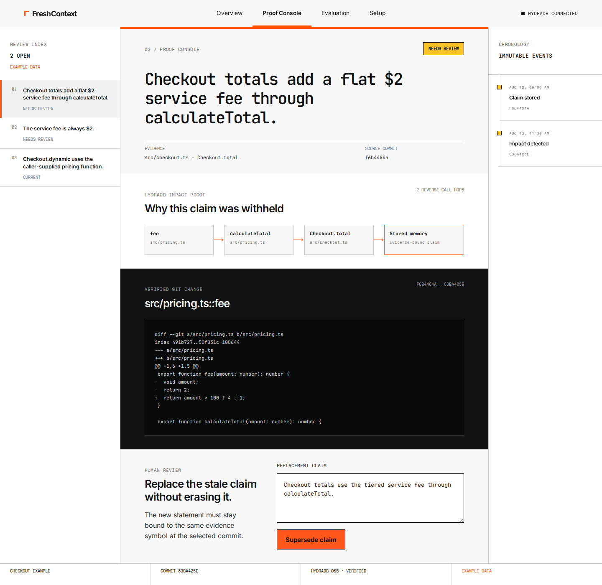

# FreshContext

FreshContext is an evidence-bound memory layer for coding agents. When committed code invalidates
something an agent remembers, FreshContext withholds the stale claim and shows the exact call path
that explains why.

Hack Hydra 2026, Track 2B: Repos, dependencies, and code as graphs.



## Run in one command

Prerequisite: Docker Engine with Docker Compose v2.

```bash
docker compose up --build --wait
```

Open <http://localhost:3000>. The command builds the product, starts the pinned HydraDB OSS engine,
creates a real two-commit TypeScript repository, indexes it, stores evidence-bound memories, and
synchronizes the code change. No account, API key, or repository configuration is required. A cold
Docker cache can take a few minutes, and `--wait` returns only after the product reports healthy.

The shortest judge path is:

1. Read the problem and mechanism on Overview.
2. Open Proof Console and inspect the review-needed claim, ordered HydraDB path, and exact Git diff.
3. Submit the suggested correction and see the original become superseded while the replacement
   becomes current.
4. Open Evaluation to inspect the attributed MCP SDK trace, real MCP recall and abstention receipt,
   baseline comparison, and visible four-hop limit.
5. Open Setup to verify the real HydraDB round trip and selected Git commit.

Stop the stack with `docker compose down`. Use `docker compose down --volumes` only when you
intentionally want to delete the local HydraDB data, generated example repository, and token.

## Use your own repository

FreshContext can index one local TypeScript repository through the production stack. The repository
must have a clean committed worktree, a tracked root `tsconfig.json`, and tracked `.ts` or `.tsx`
files. Start it with the repository mounted read-only:

```bash
FRESHCONTEXT_HOST_REPOSITORY_PATH=/absolute/path/to/repository \
FRESHCONTEXT_REPOSITORY_ID=my-repository \
docker compose -f compose.yaml -f compose.repository.yaml up --build --wait
```

Open <http://localhost:3000/setup> and select `Index repository`. Setup shows the active indexing
state, the verified commit, ingestion counts, skipped files, and syntax diagnostics. After making
and committing a code change on the host, select `Sync committed changes`. A dirty worktree, missing
`tsconfig.json`, unreadable path, or non-Git directory is rejected with an explicit state. The
browser cannot submit another filesystem path, and the container cannot write to the mounted
repository.

To connect an MCP client to the same configured graph, use this stdio command and pass the Setup
repository id and indexed commit to the FreshContext tools:

```bash
FRESHCONTEXT_HOST_REPOSITORY_PATH=/absolute/path/to/repository \
FRESHCONTEXT_REPOSITORY_ID=my-repository \
docker compose -f compose.yaml -f compose.repository.yaml --profile tools run --rm -T mcp
```

## What is built

The repository contains the reproducible runtime foundation, immutable graph persistence, the
TypeScript repository indexer, local MCP memory surface, committed-change impact engine, and a
responsive four-route web product. It starts the released HydraDB OSS image, generates a local
bearer token outside Git, performs real graph writes and strong reads, and exposes fail-closed
health and setup read models. The indexer reads a clean Git commit, resolves tracked files, imports,
functions, methods, and calls with ts-morph, and persists the commit-scoped graph to HydraDB.
Synchronization classifies changed and removed symbols, runs bounded reverse call traversals in
HydraDB, persists the shortest proof for each affected memory, and withholds that memory from later
agent context. A resumable review operation preserves the old claim, validates current evidence,
links a replacement through `SUPERSEDES`, and activates only the reviewed version. The reproducible
evaluation runs real committed TypeScript changes and compares graph traversal with a direct-file
baseline. It includes exact source from an attributed MCP TypeScript SDK fix and records a real MCP
client receiving safe context before the change, then receiving an explicit abstention after HydraDB
marks the matching memory unsafe. The interface labels example data and reports unavailable or
unconfigured states instead of inventing repository activity. Its Evaluation route reads a strictly
validated, versioned result from the same pinned-Hydra command so the proof remains available
offline.

The default startup materializes a labelled checkout example as a real two-commit Git repository.
FreshContext indexes its baseline, stores evidence-bound claims, synchronizes its fee change, and
renders the resulting HydraDB impact path and Git diff in the Proof Console. Judges can complete an
immutable review and supersession without configuring another repository first.

## Local quality checks

```bash
corepack enable
pnpm install --frozen-lockfile
pnpm check
pnpm build
pnpm test:integration
pnpm test:configured
```

The integration test creates an isolated Compose project, proves the real HydraDB round trip, runs
the immutable graph, real Git indexer, and MCP stdio contracts against the pinned engine, verifies
retry and overwrite behavior, checks the production web shell, runs the example Proof Console and
review path, interrupts and resumes a real impact sync, stops HydraDB to prove that health fails
closed, and removes only that isolated project's containers and volume.

The configured-repository test mounts a separate real Git repository read-only, indexes it through
the product API, synchronizes a second committed revision, and verifies that an uncommitted edit is
rejected and remains visible in Setup.

The browser suite checks desktop and mobile navigation, keyboard access, responsive overflow, the
live impact dossier, immutable review, and unavailable-service paths:

```bash
pnpm exec playwright install chromium
pnpm test:e2e
```

## Reproduce the evaluation

Run the pinned cases through real Git repositories and HydraDB OSS with one command:

```bash
pnpm evaluate
```

The command writes `.freshcontext/evaluation/latest.json`. The 16-label dataset includes direct,
removed, unrelated, two-hop, three-hop, and intentionally out-of-bound four-hop cases. One case is a
bounded, licensed extract of an exact public fix from the official MCP TypeScript SDK. Results
report the full confusion matrix, precision, recall, false-positive ids, false-negative ids, and the
same metrics for a direct-file baseline. The artifact also records the official MCP SDK client
calling `freshcontext_recall` before and after the committed change. The four-hop miss is kept
visible because V1 deliberately stops at three reverse call hops.

The `/evaluation` route serves `evaluation/reference-result.json`, a checked-in output from that
exact command and dataset. The interface labels it `Verified offline reference`. A missing, corrupt,
or internally inconsistent artifact fails visibly and shows no scores. Regenerating the local
artifact never writes into the product HydraDB volume, and the write is atomic so readers don't see
partial JSON.

## Agent tool contract

The local stdio server publishes three bounded tools:

- `freshcontext_remember` stores a claim only after every cited symbol resolves at the selected
  indexed commit.
- `freshcontext_recall` returns current claims for an exact symbol, reports withheld unsafe matches,
  and explicitly abstains when no safe claim exists.
- `freshcontext_status` reports the selected completed index and its real ingestion counts.

The MCP process is packaged in the `mcp-runtime` Docker target. Its contract test spawns the real
stdio process and exercises it against the pinned HydraDB container. There is no in-memory or second
database fallback. The reproducible evaluation also creates an official SDK client over the SDK's
linked in-process MCP transport and publishes its checked recall and abstention receipt.

## Graph-native invalidation

FreshContext compares immutable symbol snapshots by stable code identity and normalized source hash.
For every changed or removed old symbol, it runs four explicit HydraDB query shapes: direct support,
then one, two, and three reverse `CALLS` hops. One shortest deterministic path is persisted per
affected memory as `Change`, `Impact`, and ordered `ImpactStep` records. Recall stays unavailable
while synchronization is incomplete, and only switches to the new commit after every proof and
memory state verifies.

## Preserved review history

Review never edits or deletes an unsafe memory. It creates a new evidence-bound replacement as
`pending`, writes the chronology edge and events, marks the original `superseded`, then activates
the replacement. If the process stops between those state changes, recall returns neither version as
current. Retrying the same deterministic operation completes the missing steps without duplicate
history.

## Why HydraDB matters

HydraDB stores code structure, evidence-linked memories, commit chronology, and transitive impact
paths. FreshContext's core result depends on graph traversal across those relationships. There is no
fallback database or hardcoded success path.

The runtime is pinned to HydraDB `v0.1.1`, source revision
`02a40025d2d57e97ab2754c8256219cdbfeab379`, using the multi-platform image digest:

```text
ghcr.io/hydra-db/hydradb@sha256:db78309a233be54662db29744047e985a39b51c45a270d1a1f47c31a62cdb709
```

FreshContext supplies the application layers that HydraDB OSS doesn't provide here: TypeScript
ingestion, an immutable code and memory schema, bounded impact queries, safe recall, human
supersession, and result evaluation. Removing HydraDB removes the transitive proof, lifecycle
history, and the product's safe recall decision.

## Solo build and attribution

FreshContext was built solo by [Alike001](https://github.com/Alike001). OpenAI Codex assisted with
research, implementation, testing, and documentation. Every product decision and the final code were
reviewed and verified by the participant.

HydraDB OSS, direct libraries, development tools, and bundled fonts are credited in
[THIRD_PARTY_NOTICES.md](THIRD_PARTY_NOTICES.md). Exact dependency versions are pinned in
`pnpm-lock.yaml` and the container image digests are pinned in `Dockerfile` and `compose.yaml`.

## License

FreshContext source is [MIT licensed](LICENSE). Third-party components retain their own licenses.
